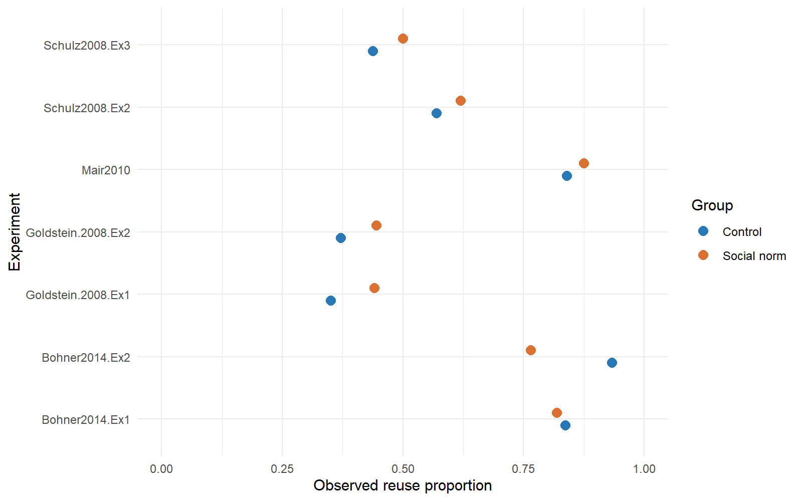
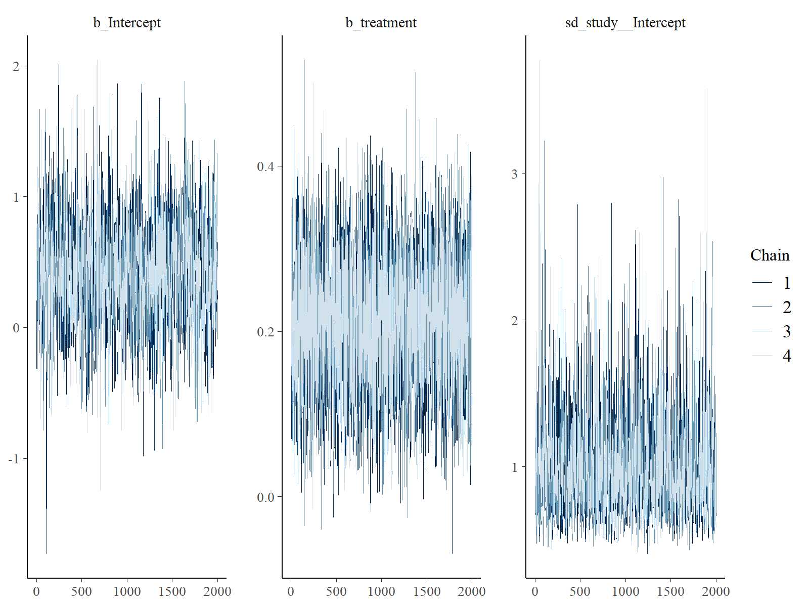
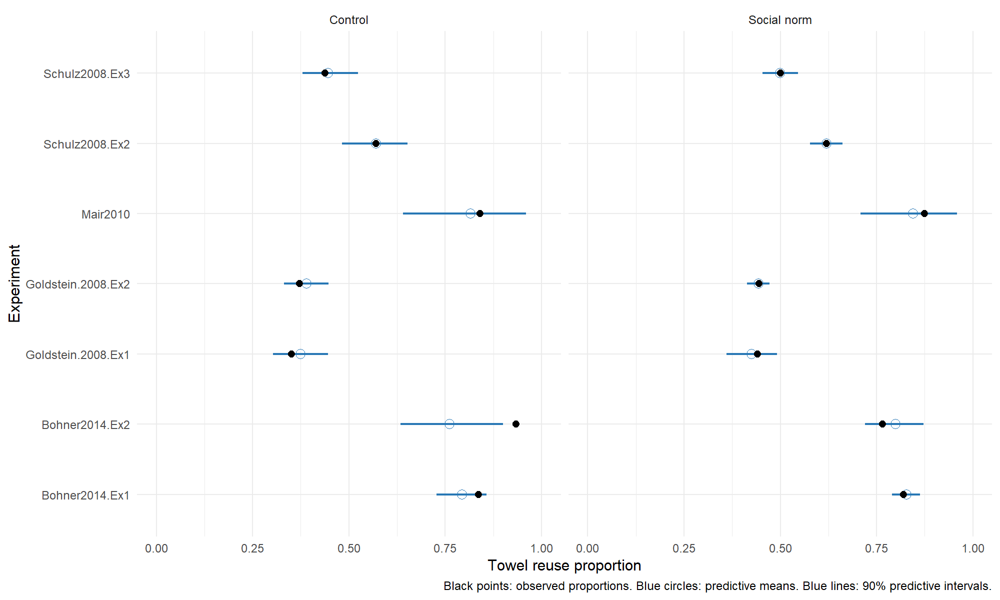

# Exercise: Hierarchical Models and Testing

**Author:** [Lei Huang]  
**Date:** [22-9-2026]  

## 1. Objective

This exercise examines whether descriptive social norm messages increase towel
reuse compared with control messages. Data from several experiments are analysed
together using a Bayesian hierarchical model. The model accounts for differences
in baseline towel reuse between experiments.

## 2. Software

This analysis was written in R 4.3.3 and run in RStudio.

The following R packages were used:

- brms: specify and fit the Bayesian hierarchical model.
- rstan: compile the Stan model and perform MCMC sampling.
- readr: read the semicolon-separated data file.
- dplyr and tidyr: prepare and reshape the data.
- ggplot2: create figures.
- posterior: summarise posterior samples and calculate MCMC diagnostics.
- bayesplot: plot MCMC chains to assess mixing.

## 3. Data

The input file is `towelData.csv`. The supplied data screenshot contains seven
experiments and 28 rows. Each row gives a count for one experiment, one message
group and one towel reuse outcome. The file uses semicolons as separators.

| Variable | Description |
| --- | --- |
| `Source` | Unique experiment identifier |
| `AuthorName` | Authors of the original study |
| `Experiment` | Experiment number within a publication |
| `Year` | Publication year |
| `Group` | Control or Social Norm |
| `Towel.Reuse` | Yes or No |
| `Count` | Count for the corresponding group and outcome |

`Source` is used as the grouping variable because one publication may contain
more than one experiment. Using only the author name would combine distinct
experiments.

The following code reads the original file and displays its structure:

```r
raw <- read.csv2(
  "towelData.csv",
  fileEncoding = "latin1",
  stringsAsFactors = FALSE
)

names(raw)
head(raw, 8)
```

The script's column settings must use `study_columns <- c("Source")` and
`group_column <- "Group"`.

## 4. Data preparation

## 4. Data preparation

The data were read from `towelData.csv` using a semicolon separator.
Following the example provided in the exercise, the Yes and No counts
were placed in separate columns using `pivot_wider()`. The total number
of observations in each group was calculated as `Yes + No`.

Each experiment was identified by `Source`, which was converted to a
factor named `study`. The control group was coded as 0 and the social
norm group as 1. The observed reuse proportion was calculated for
descriptive plots.

```r
library(readr)
library(tidyr)
library(dplyr)

towel_data <- read_delim(
  "towelData.csv",
  delim = ";",
  locale = locale(encoding = "Latin1"),
  show_col_types = FALSE
) %>%
  pivot_wider(
    names_from = Towel.Reuse,
    values_from = Count
  ) %>%
  mutate(
    Total = Yes + No,
    study = factor(Source),
    treatment = if_else(Group == "Social Norm", 1L, 0L),
    observed_rate = Yes / Total
  ) %>%
  arrange(study, treatment)
```

The prepared data were inspected to check the counts, group coding and
number of experiments.

```r
towel_data %>%
  select(study, treatment, Yes, No, Total, observed_rate) %>%
  mutate(observed_rate = round(observed_rate, 3)) %>%
  print(n = Inf, width = Inf)

cat("Number of rows:", nrow(towel_data), "\n")
cat("Number of experiments:", nlevels(towel_data$study), "\n")
```

Output:

```text
> print(towel_data)
# A tibble: 14 × 11
   Source             AuthorName          Experiment  Year Group         Yes    No Total study              treatment observed_rate
   <chr>              <chr>                    <dbl> <dbl> <chr>       <dbl> <dbl> <dbl> <fct>                  <int>         <dbl>
 1 Bohner2014.Ex1     Bohner & Schlüter            1  2014 Control       123    24   147 Bohner2014.Ex1             0         0.837
 2 Bohner2014.Ex1     Bohner & Schlüter            1  2014 Social Norm   472   104   576 Bohner2014.Ex1             1         0.819
 3 Bohner2014.Ex2     Bohner & Schlüter            2  2014 Control        28     2    30 Bohner2014.Ex2             0         0.933
 4 Bohner2014.Ex2     Bohner & Schlüter            2  2014 Social Norm   101    31   132 Bohner2014.Ex2             1         0.765
 5 Goldstein.2008.Ex1 Goldstein et al.             1  2008 Control        74   137   211 Goldstein.2008.Ex1         0         0.351
 6 Goldstein.2008.Ex1 Goldstein et al.             1  2008 Social Norm    98   124   222 Goldstein.2008.Ex1         1         0.441
 7 Goldstein.2008.Ex2 Goldstein et al.             2  2008 Control       103   174   277 Goldstein.2008.Ex2         0         0.372
 8 Goldstein.2008.Ex2 Goldstein et al.             2  2008 Social Norm   587   731  1318 Goldstein.2008.Ex2         1         0.445
 9 Mair2010           Mair & Bergin-Seers          1  2010 Control        21     4    25 Mair2010                   0         0.84 
10 Mair2010           Mair & Bergin-Seers          1  2010 Social Norm    21     3    24 Mair2010                   1         0.875
11 Schulz2008.Ex2     Schulz et al.                2  2008 Control        77    58   135 Schulz2008.Ex2             0         0.570
12 Schulz2008.Ex2     Schulz et al.                2  2008 Social Norm   406   249   655 Schulz2008.Ex2             1         0.620
13 Schulz2008.Ex3     Schulz et al.                3  2008 Control        82   105   187 Schulz2008.Ex3             0         0.439
14 Schulz2008.Ex3     Schulz et al.                3  2008 Social Norm   278   277   555 Schulz2008.Ex3             1         0.501
> nrow(towel_data)
[1] 14
> nlevels(towel_data$study)
[1] 7
```

## 5. Descriptive analysis

Before fitting the model, the observed towel reuse proportions were
compared between the control and social norm groups in each experiment.
The proportion was calculated as the number of reuse observations
divided by the total number of observations in that group.

Different colours were used to distinguish the two groups. The
coordinates were flipped to make the experiment names easier to read.

```r
p_observed <- ggplot(
  towel_data,
  aes(
    x = study,
    y = observed_rate,
    colour = factor(treatment),
    group = treatment
  )
) +
  geom_point(
    size = 3,
    position = position_dodge(width = 0.4)
  ) +
  scale_colour_manual(
    values = c("0" = "#2878B5", "1" = "#DB7033"),
    breaks = c("0", "1"),
    labels = c("Control", "Social norm")
  ) +
  coord_flip() +
  ylim(0, 1) +
  theme_minimal() +
  labs(
    x = "Experiment",
    y = "Observed reuse proportion",
    colour = "Group"
  )

print(p_observed)

ggsave(
  "results/observed_rates.png",
  plot = p_observed,
  width = 8,
  height = 5,
  dpi = 200
)
```

### Results



*Figure 1. Observed towel reuse proportions in the control and social
norm groups across seven experiments.*

Reuse proportions differ substantially between experiments. The social
norm group has a higher observed reuse proportion in five experiments.
In the two experiments reported by Bohner and Schlüter, the control
group has a higher proportion.

The differences in control-group proportions suggest that baseline
reuse levels vary between experiments. This supports allowing
experiment-specific intercepts in the model.

These are descriptive comparisons. The plot does not show uncertainty
intervals or differences in sample size. A hierarchical model is used
in the next section to estimate the intervention effect while accounting
for differences in baseline reuse.

## 6. Model specification and Bayesian estimation

### Model

A binomial distribution was used because the response is the number
of towel reuse observations out of a known total in each group.

For experiment j and group g, the model is:

$$
Y_{jg} \sim \operatorname{Binomial}(n_{jg}, p_{jg})
$$

$$
\operatorname{logit}(p_{jg}) = \alpha + u_j + \beta x_g,
\qquad
u_j \sim N(0, \tau^2).
$$

Here, x is 0 for the control group and 1 for the social norm group.
The parameter alpha is the overall control-group intercept on the
log-odds scale. The random intercept u_j allows the baseline reuse
probability to differ between experiments. The parameter tau describes
the between-experiment variation in these intercepts.

The parameter beta represents the common intervention log odds ratio.
A positive beta indicates a higher reuse probability in the social norm
group within an experiment. This model assumes a common intervention
effect on the log-odds scale.

The binomial model assumes that observations within each group are
independent conditional on the model parameters and share the same
reuse probability.

```r
model_formula <- bf(
  Yes | trials(Total) ~
    0 + Intercept + treatment + (1 | study)
)
```

### Prior distributions

The following priors were specified:

$$
\alpha \sim N(0, 1.5^2),
\qquad
\beta \sim N(0, 1^2),
\qquad
\tau \sim \operatorname{Exponential}(\text{rate}=1).
$$

The intercept prior allows a broad range of baseline reuse levels.
The prior for beta gives equal prior probability to positive and
negative effects and reduces support for extremely large log odds
ratios. The exponential prior restricts tau to positive values and
favours smaller between-experiment variation while allowing larger
values.

```r
priors <- c(
  set_prior("normal(0, 1.5)", class = "b", coef = "Intercept"),
  set_prior("normal(0, 1)", class = "b", coef = "treatment"),
  set_prior("exponential(1)", class = "sd", group = "study")
)
```

### Estimation

The model is fitted using brms with the rstan backend. Four MCMC chains
are specified, each with 4,000 iterations, including 2,000 warmup
iterations. This gives 8,000 retained posterior draws in total.
Sampling reliability is assessed in the next section.

```r
fit <- brm(
  formula = model_formula,
  data = towel_data,
  family = binomial(link = "logit"),
  prior = priors,
  chains = 4,
  iter = 4000,
  warmup = 2000,
  cores = 2,
  seed = 1234,
  backend = "rstan",
  control = list(adapt_delta = 0.99, max_treedepth = 12)
)

saveRDS(fit, "results/towel_model.rds")

print(summary(fit, prob = 0.90))
```

Output:

```text
 print(summary(fit, prob = 0.90))
 Family: binomial 
  Links: mu = logit 
Formula: Yes | trials(Total) ~ 0 + Intercept + treatment + (1 | study) 
   Data: towel_data (Number of observations: 14) 
  Draws: 4 chains, each with iter = 4000; warmup = 2000; thin = 1;
         total post-warmup draws = 8000

Multilevel Hyperparameters:
~study (Number of levels: 7) 
              Estimate Est.Error l-90% CI u-90% CI Rhat Bulk_ESS Tail_ESS
sd(Intercept)     1.00      0.32     0.61     1.59 1.00     1761     2929

Regression Coefficients:
          Estimate Est.Error l-90% CI u-90% CI Rhat Bulk_ESS Tail_ESS
Intercept     0.43      0.38    -0.19     1.03 1.00     1767     2460
treatment     0.21      0.08     0.08     0.34 1.00     4543     4396

Draws were sampled using sampling(NUTS). For each parameter, Bulk_ESS
and Tail_ESS are effective sample size measures, and Rhat is the potential
scale reduction factor on split chains (at convergence, Rhat = 1).
```

## 7. MCMC diagnostics

I checked Rhat, effective sample sizes, divergent transitions, and
maximum tree depth hits. I also inspected trace plots for the
intercept, treatment effect, and between-study standard deviation.

All reported Rhat values rounded to 1.00. The smallest Bulk ESS was
approximately 1761, and the smallest Tail ESS was approximately 2460.
These results suggest that the chains mixed well and provided useful
effective sample sizes for posterior summaries.

The sampler diagnostics were:

```text
divergent_transitions    max_treedepth_hits
                    0                     0
```

There were no divergent transitions after warmup, and no iterations
reached the maximum tree depth of 12.



The four chains overlap and fluctuate within similar ranges.
There is no clear long-term trend or persistent separation between
chains. These diagnostics support the reliability of the posterior
sampling. Model fit will be assessed separately using a posterior
predictive check.

## 8. Posterior estimates


| Parameter | Posterior mean | 90% credible interval |
|-----------|---------------:|----------------------:|
| alpha | 0.426 | [-0.187, 1.031] |
| beta | 0.210 | [0.083, 0.336] |
| tau | 0.995 | [0.611, 1.594] |
| Odds ratio | 1.238 | [1.087, 1.399] |

The posterior mean of the treatment effect was 0.210, with a
90% credible interval of [0.083, 0.336]. The interval lies
above zero and supports a positive intervention effect under
the specified model and priors.

The posterior mean odds ratio was 1.238, with a 90% credible
interval of [1.087, 1.399]. This corresponds to approximately
23.8% higher odds of towel reuse in the social norm group
compared with the control group within the same study.

The posterior mean of the between-study standard deviation
was 0.995, with a 90% credible interval of [0.611, 1.594].
This suggests variation in baseline towel reuse across studies.
The treatment effect on the log-odds scale is assumed to be
the same across studies.

## 9. Bayesian hypothesis testing

I tested whether the social norm intervention increases the
probability of towel reuse. The parameter beta represents the
common treatment effect on the log-odds scale.

The hypotheses were:

$$
H_0: \beta \leq 0,
\qquad
H_1: \beta > 0.
$$

The null hypothesis includes both zero and negative effects.
The alternative hypothesis represents a positive intervention
effect. Since the inverse-logit function is increasing, a positive
beta implies a higher probability of towel reuse in the intervention
group within the same study.

I estimated the posterior probability of each hypothesis using
the proportion of posterior draws that satisfied its condition.

```r
# Extract posterior draws of the treatment effect
draws <- posterior::as_draws_df(fit)
beta <- draws$b_treatment

# Estimate posterior probabilities of the hypotheses
p_positive <- mean(beta > 0)
p_nonpositive <- mean(beta <= 0)

# Organise the results
hypothesis_results <- data.frame(
  Hypothesis = c("H0: beta <= 0", "H1: beta > 0"),
  Posterior_probability = c(p_nonpositive, p_positive)
)

print(hypothesis_results, digits = 4, row.names = FALSE)

# Save the results
readr::write_csv(
  hypothesis_results,
  "results/hypothesis_results.csv"
)
```

Output:

```text
   Hypothesis Posterior_probability
H0: beta <= 0              0.001625
 H1: beta > 0              0.998375
```

The estimated posterior probability of a positive treatment effect
was 0.998375, or approximately 99.84%. The probability of a zero
or negative effect was approximately 0.16%.

These results provide strong support for a positive intervention
effect under the specified model and priors. This agrees with
the 90% credible interval for beta, [0.083, 0.336], which lies
entirely above zero.

These probabilities describe posterior uncertainty about beta.
They are not frequentist p-values. They are estimated from a
finite number of MCMC draws and therefore have Monte Carlo
uncertainty.

The conclusion concerns the common treatment effect assumed
by the model. Differences in treatment effects across studies
are not estimated in this model.

## 10. Posterior predictive check

I used a posterior predictive check to assess whether the model
could reproduce the observed towel reuse proportions.

Using 1000 posterior draws, I simulated replicated counts for
each study and treatment group. The original sample sizes were
retained, and the study-specific random intercepts were included.

I divided the simulated counts by the corresponding sample sizes.
For each group, I calculated the predictive mean and a 90%
equal-tailed predictive interval using the 5th and 95th percentiles.

These predictive intervals include both posterior parameter
uncertainty and binomial sampling variation.



Black points represent observed proportions. Blue circles show
predictive means, and blue lines show 90% predictive intervals.

This check assesses the model's ability to reproduce data from
the seven observed studies. It does not directly assess prediction
for a new study.

## 11. Discussion and conclusion

The Bayesian hierarchical binomial model provided strong support
for a positive effect of the social norm intervention under the
specified model and priors. The posterior mean treatment effect
was 0.210, with a 90% credible interval of [0.083, 0.336].
The estimated posterior probability that beta was positive
was approximately 99.84%.

The posterior mean odds ratio was 1.238, with a 90% credible
interval of [1.087, 1.399]. This indicates higher odds of towel
reuse in the intervention group within a study. The corresponding
increase in probability depends on the baseline reuse probability.

Baseline towel reuse varied across studies. The posterior mean
of the between-study standard deviation was 0.995, with a 90%
credible interval of [0.611, 1.594]. The hierarchical model
represented these differences using study-specific intercepts.

The MCMC diagnostics supported reliable posterior sampling.
All displayed Rhat values rounded to 1.00, effective sample sizes
were above 1700, and there were no divergent transitions or
maximum tree depth hits. The trace plots showed overlapping
chains without clear long-term trends.

The posterior predictive check showed reasonable agreement for
most groups. However, the model underestimated towel reuse in
the control group of Bohner2014.Ex2. Its observed proportion
was 0.933, above the 90% predictive interval of [0.633, 0.900].

An important limitation is the assumption of a common treatment
effect on the log-odds scale. The model accounts for differences
in baseline reuse, but does not estimate variation in intervention
effects across studies. A model with study-specific treatment
effects could be considered in further analysis, although only
seven studies are available.

The results also depend on the chosen priors. Prior sensitivity
was not assessed in this analysis. The positive-effect probability
should therefore be interpreted as conditional on these modelling
choices, rather than as evidence that the intervention will improve
towel reuse in every hotel.

## References

Scheibehenne, B., Jamil, T., & Wagenmakers, E.-J. (2016). Bayesian Evidence
Synthesis Can Reconcile Seemingly Inconsistent Results: The Case of Hotel Towel
Reuse. *Psychological Science, 27*(7), 1043-1046.
https://doi.org/10.1177/0956797616644081

Sahlin, U. *Lecture Hierarchical Models and Testing*. BERN02 course material.
